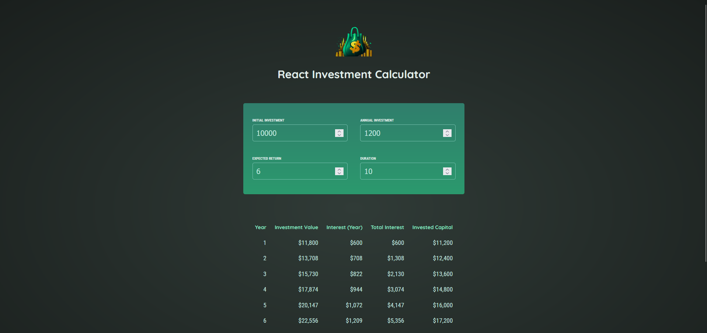

# Investment Calculator Using React

This project is a simple investment calculator built using React. It allows users to input their initial investment, annual investment, expected return rate, and duration of investment , and calculates the future value of their investment based on these parameteres.

## Preview 

## Features 

- **User Input:** Users can input their initial investment, annual investment, expected return, and investment duration.
- **Validation:** The calculator validates the input duration to ensure it is greater than zero.
- **Results:** Once valid input is provided, the calculator displays the calculated results, including the future value of the investment.

## Technology Stack

- **Frontend:** React.js
- **State Management:** React Hooks
- **Styling:** CSS
- **Development Tools:** NPM

## Usage

To run this project locally:

1. Clone this repository to your local machine.
2. Navigate to the project directory.
3. Run `npm install` to install dependencies.
4. Run `npm run dev` to start the development server.
5. Open your browser and go to `http://localhost:5173/` to view the application.

## Contributing

Contributions are welcome! If you would like to contribute to this project, feel free to fork the repository and submit a pull request with your changes.